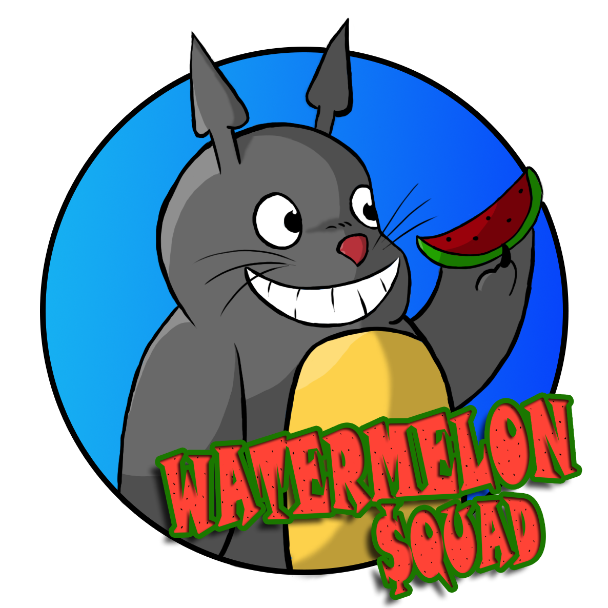

# GunBird by Watermelon $quad

Gunbird is a shot ‘em up made in 1994 by Psikyo. The original game was released in arcade machines. In the game, we can choose one of the 5 playable characters. The game has 4 stages in random order and a final stage. Every stage consists in hordes of enemies and a final boss.

The plot of the game is about a magic mirror. This mirror is divided in 4 parts, and the full mirror gives a wish to its owner, after winning in a battle to Atler, the final boss based in Gizmo, the main character from Gremlins. You choose one character and you need to take the mirror pieces from a crew of pirates, the Trump. Each character has their own plotlines and different wishes to the magic mirror.

## Members

### Art/Design ###

[David Lozano Sánchez](https://github.com/DavidTheMaaster)

### Code ###

[Alex Campamar Redol](https://github.com/Acaree)

### QA ###

[Joan Valiente Lorite](https://github.com/JoanValiente) 

## Gameplay

<iframe width="560" height="315" src="https://www.youtube.com/embed/CQuciODIOFc" frameborder="0" allowfullscreen></iframe>

## Game Controls

### Player 1 ###
⇧⇦⇩⇨ 
Move

#### N #### 
Shoot

#### M #### 
Bomb

### Player 2 ###

#### WASD #### 
Move

#### C #### 
Shoot

#### V #### 
Bomb

### GamePad ##

#### Joystick and D-Pad #### 
Move

#### A #### 
Shoot

#### B #### 
Bomb

#### Download the latest version of gunbird [here](https://www.youtube.com/watch?v=CQuciODIOFc&t=21s) ####
#### Check our [GitHub repositorie](https://www.youtube.com/watch?v=CQuciODIOFc&t=21s) ####
#### Look for more information in our [wiki](https://www.youtube.com/watch?v=CQuciODIOFc&t=21s) ####

